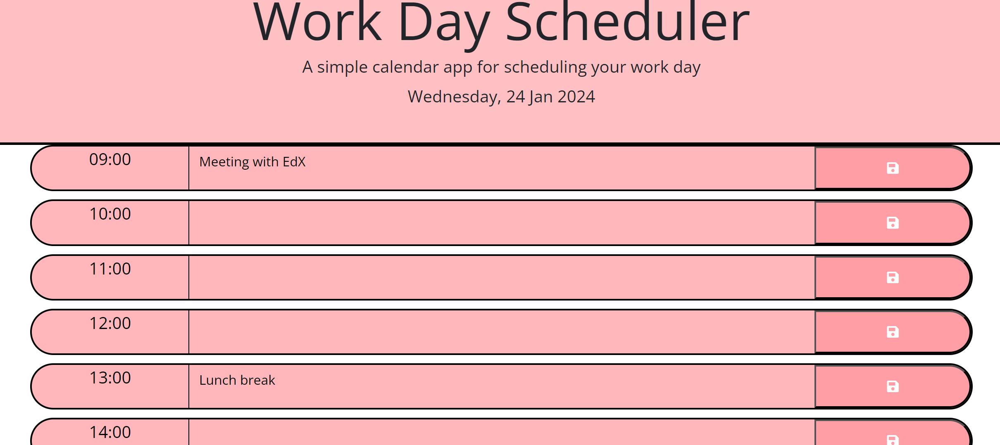

# Daily Work Day Planner App

GitHub Link: https://github.com/Maeldeis/PlannerApp

Deployed Live Link: https://maeldeis.github.io/PlannerApp

**This app will run in the browser and feature dynamically updated HTML and CSS powered by jQuery.**

## This app performs the following tasks:

* Displays the current day at the top of the calender when a user opens the planner.
 
* Present timeblocks for standard business hours when the user scrolls down.
 
* Colour-code each timeblock based on past, present, and future when the timeblock is viewed.
 
* Allow a user to enter an event when they click a timeblock

* Save the event in local storage when the save button is clicked in that timeblock.

* Persist events between refreshes of a page

## The following image demonstrates the final application:

